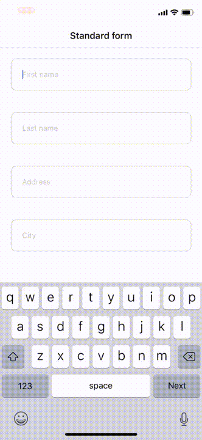

# react-native-nextable-form

Wrapper for React Native forms for handling 'next' and 'done' buttons.



#### Why you might need this?

If you are looking to build highly accessible forms in React Native, this is the case you definitely need to handle. Standard approach to this problem is to manually focus input fields. "React native nextable form" handles that without making your code dirty!

## Installation

NPM:

```
npm install react-native-nextable-form
```

YARN:

```
yarn add react-native-nextable-form
```

## Usage

__TextInput or components that are selected for usage can be placed anywhere in children node and nested as many times as needed__

### 1. Usage with TextInput from 'react-native'

```typescript
import React from 'react';
import { TextInput, View } from 'react-native';
import NextableForm from 'react-native-nextable-form';

const MyForm = () => (
  <View>
    <NextableForm>
      <TextInput autoFocus placeholder="Input 1" />
      <View>
        <TextInput placeholder="Input 2" />
      </View>
    </NextableForm>
  </View>
);

export default MyForm;
```

### 2. Usage with styled-components

*It is possible to mix types that are specified*

```typescript
import React from 'react';
import { TextInput, View } from 'react-native';
import styled from 'styled-components/native';

const MyInput = styled.TextInput`color: red;`;

const MyForm = () => (
  <View>
    <NextableForm inputComponentTypes={[MyInput, TextInput]}>
      <MyInput autoFocus placeholder="Input 1" />
      <View>
        <TextInput placeholder="Input 2" />
      </View>
    </NextableForm>
  </View>
);

export default MyForm;
```

### 3. Usage with custom components that contain TextInput

__Always forward the ref for TextInput__

```typescript
const FormGroup = forwardRef(({ label, ...props }, ref) => {
  return (
    <React.Fragment>
      <Text style={styles.label}>{label}</Text>
      <TextInput ref={ref} style={styles.input} {...props} />
    </React.Fragment>
  );
});


const MyForm = () => (
  <View>
    <NextableForm inputComponentTypes={[CustomInput]}>
      <FormGroup autoFocus label="Input 1 />
    </NextableForm>
  </View>
);
```

## Examples

All the examples are located in 'example/screens' folder.

Running in expo:

```
cd example
yarn start
```

## License

MIT
